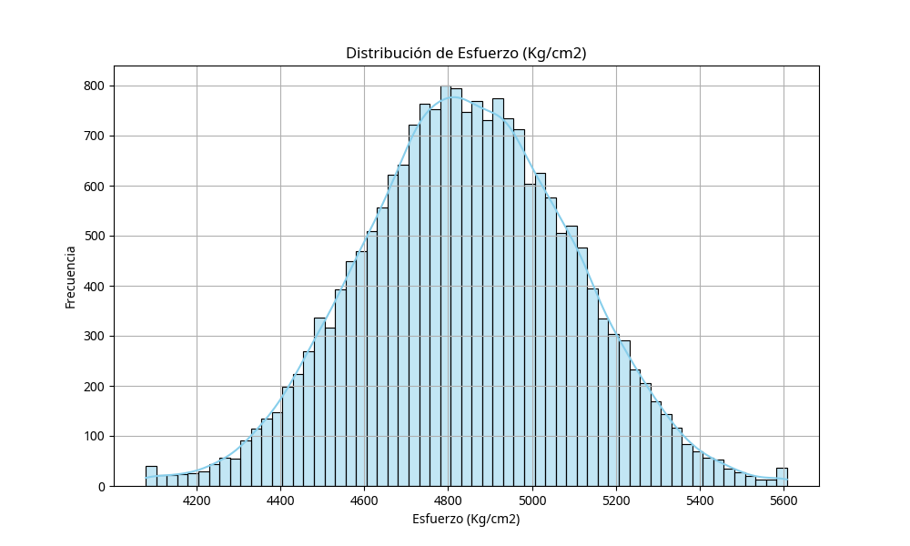
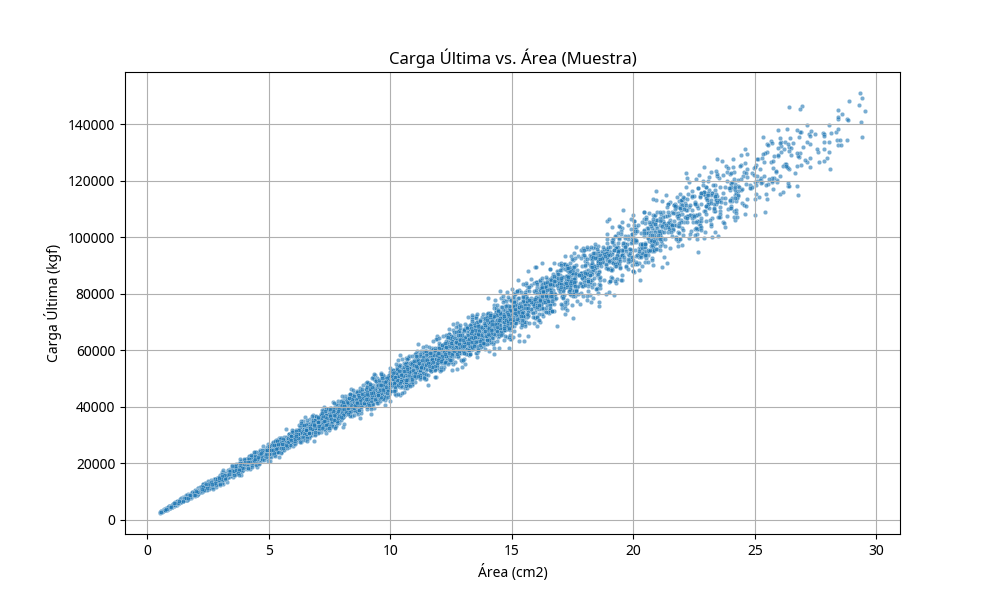
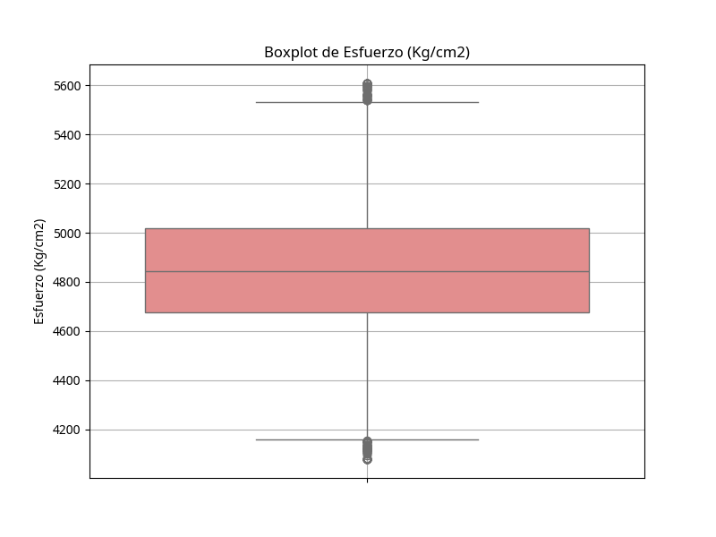
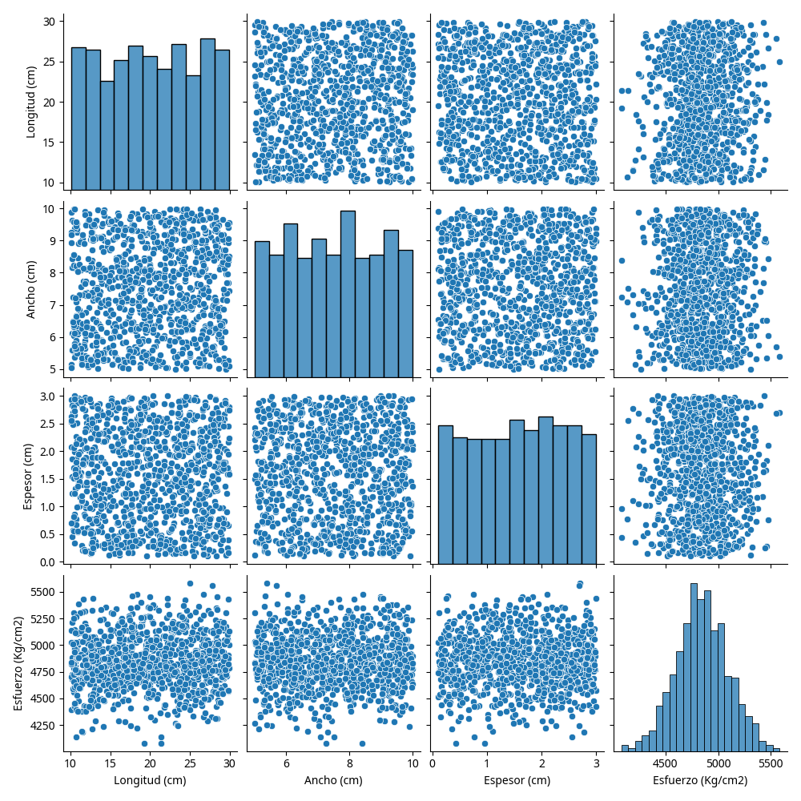

# 🌌 Predicción de Carga Última en Acero A36: Un Enfoque de Vanguardia con Machine Learning

## ✨ Visión General del Proyecto

Este proyecto representa una inmersión profunda en la aplicación de la inteligencia artificial para la optimización de materiales en la ingeniería. Desarrollamos un modelo de Machine Learning de última generación, diseñado para predecir con precisión la carga última en pruebas de tensión de acero A36. Utilizando las dimensiones físicas de las muestras como variables de entrada, nuestro enfoque no solo mejora la eficiencia en el diseño estructural, sino que también reduce la dependencia de costosas y destructivas pruebas físicas.

El acero A36, un pilar en la industria de la construcción y la ingeniería estructural, es conocido por su robustez y rentabilidad. La capacidad de anticipar su comportamiento bajo carga máxima antes de la fractura es un avance crítico para:

- **Optimización del Diseño Estructural**: Permite a los ingenieros crear componentes más seguros y eficientes.
- **Reducción de Pruebas Destructivas**: Minimiza los costos y el tiempo asociados con los ensayos tradicionales.
- **Mejora Continua de la Calidad**: Asegura procesos de fabricación más fiables y seguros.
- **Aceleración del Desarrollo de Productos**: Impulsa la innovación en la metalurgia.


## 🎯 Objetivos Estratégicos

Nuestra misión es trascender los límites actuales de la predicción de materiales, estableciendo nuevos estándares de precisión y eficiencia.

### Objetivo Principal

Desarrollar un modelo predictivo robusto y de alta fidelidad que estime la carga de tracción última en muestras de acero A36, basándose exclusivamente en sus dimensiones físicas. Este modelo será la piedra angular para una ingeniería más inteligente y predictiva.

### Objetivos Específicos

Para alcanzar nuestra visión, nos hemos propuesto:

- **Análisis Exploratorio Exhaustivo**: Realizar una exploración profunda del conjunto de datos de pruebas de tensión, desvelando patrones ocultos y relaciones críticas.
- **Ingeniería de Características Avanzada**: Implementar técnicas de ingeniería de características de vanguardia para potenciar el rendimiento del modelo, transformando datos brutos en información valiosa.
- **Evaluación Algorítmica Rigurosa**: Evaluar múltiples algoritmos de Machine Learning con un enfoque crítico, seleccionando la arquitectura más adecuada para la complejidad de nuestro desafío.
- **Validación Métrica Estricta**: Validar el modelo utilizando métricas de regresión estándar de la industria, asegurando su fiabilidad y precisión en escenarios del mundo real.
- **Visualizaciones Impactantes**: Crear representaciones visuales profesionales y estéticamente atractivas que faciliten la interpretación de los resultados, comunicando la complejidad de los datos de manera intuitiva.


## 📊 El Universo de Datos: Nuestro Conjunto de Pruebas

Nuestro modelo se nutre de un vasto y detallado conjunto de datos, compuesto por **20,000 registros** de pruebas de tensión realizadas en muestras de acero A36. Cada registro es una ventana a las propiedades mecánicas del material, capturando la esencia de su comportamiento bajo estrés.

### Variables Fundamentales

La información se estructura en las siguientes variables clave:

| Variable | Descripción | Unidad | Tipo |
|:-------------------|:---------------------------------------------------|:---------|:----------|
| `Longitud (cm)` | Dimensión longitudinal de la muestra | cm | Numérica |
| `Ancho (cm)` | Dimensión transversal de la muestra | cm | Numérica |
| `Espesor (cm)` | Espesor de la muestra | cm | Numérica |
| `Carga Última (kgf)` | Carga máxima soportada antes de la fractura | kgf | Numérica (Objetivo) |

### Características Derivadas: Ampliando la Perspectiva

Para enriquecer nuestro análisis y dotar al modelo de una comprensión más profunda, hemos generado características derivadas que revelan relaciones intrínsecas del material:

- **Área (cm²)**: Calculada como `Ancho × Espesor`. Esta variable es crucial, ya que la sección transversal de la muestra influye directamente en su capacidad de carga.
- **Estrés (Kg/cm²)**: Calculado como `Carga Última / Área`. El estrés es una medida fundamental de la resistencia interna del material, proporcionando una visión normalizada de la carga soportada.

Estas características derivadas no solo optimizan el rendimiento predictivo del modelo, sino que también ofrecen una interpretación más rica de las propiedades mecánicas del acero A36, trascendiendo la información bruta para desvelar el verdadero potencial de los datos.


## 🛠️ Ecosistema Tecnológico: Herramientas que Impulsan la Innovación

La construcción de este modelo predictivo ha sido posible gracias a la sinergia de un conjunto de tecnologías de vanguardia, seleccionadas por su robustez, flexibilidad y capacidad para manejar grandes volúmenes de datos y algoritmos complejos.

### Lenguajes y Entornos de Desarrollo

- **Python 3.8+**: El lenguaje de programación central de nuestro proyecto, elegido por su versatilidad, su vasta colección de librerías para Machine Learning y su activa comunidad de desarrollo.
- **Jupyter Notebook**: El entorno interactivo que nos ha permitido explorar datos, desarrollar algoritmos y visualizar resultados de manera ágil y colaborativa, facilitando un ciclo de experimentación rápido.

### Librerías de Machine Learning: El Corazón Predictivo

- **Scikit-learn**: La columna vertebral de nuestro desarrollo de modelos, ofreciendo una implementación eficiente de algoritmos de Machine Learning y métricas de evaluación esenciales para validar la precisión de nuestras predicciones.
- **Pandas**: La herramienta indispensable para la manipulación y el análisis de datos, permitiéndonos estructurar, limpiar y transformar el vasto conjunto de datos de pruebas de tensión con facilidad.
- **NumPy**: Fundamental para las operaciones numéricas de alto rendimiento y el álgebra lineal, optimizando los cálculos subyacentes a nuestros algoritmos de Machine Learning.

### Visualización de Datos: Dando Vida a los Insights

- **Matplotlib**: Utilizada para la creación de gráficos estáticos, proporcionando una base sólida para la visualización de tendencias y distribuciones en nuestros datos.
- **Seaborn**: Complementa a Matplotlib, permitiéndonos generar visualizaciones estadísticas avanzadas y estéticamente atractivas, revelando relaciones complejas y patrones significativos en el conjunto de datos.

### Herramientas de Desarrollo: La Infraestructura del Proyecto

- **Git**: El sistema de control de versiones que ha garantizado la integridad y la trazabilidad de nuestro código, facilitando el trabajo en equipo y la gestión de cambios.
- **GitHub**: La plataforma remota que aloja nuestro repositorio, promoviendo la colaboración, la revisión de código y la gestión de proyectos de manera eficiente.


## 🚀 Instalación y Configuración: Desplegando el Futuro

Para interactuar con este proyecto y desatar el poder de la predicción de carga última, siga estos sencillos pasos. Hemos diseñado el proceso para ser lo más fluido posible, permitiéndole sumergirse rápidamente en el análisis y la experimentación.

### Prerrequisitos Esenciales

Antes de comenzar, asegúrese de tener instaladas las siguientes herramientas en su entorno:

- **Python 3.8 o superior**: La base de nuestro ecosistema de desarrollo.
- **pip**: El gestor de paquetes de Python, fundamental para instalar las dependencias del proyecto.
- **Git**: Para clonar el repositorio y gestionar las versiones del código.

### Pasos de Instalación: Un Viaje Guiado

1. **Clonar el Repositorio**: Inicie su viaje obteniendo una copia local de nuestro proyecto. Abra su terminal o línea de comandos y ejecute:

   ```bash
   git clone https://github.com/MFelix9310/a36-steel-prediction.git
   cd a36-steel-prediction
   ```

2. **Crear un Entorno Virtual (Recomendado)**: Para mantener su entorno de desarrollo limpio y evitar conflictos de dependencias, le recomendamos encarecidamente crear un entorno virtual. Esto aísla las librerías de este proyecto de otras instalaciones de Python en su sistema:

   ```bash
   python -m venv venv
   source venv/bin/activate  # En Windows: venv\Scripts\activate
   ```

3. **Instalar Dependencias**: Con su entorno virtual activado, instale todas las librerías necesarias para el proyecto. Estas se encuentran listadas en el archivo `requirements.txt`:

   ```bash
   pip install -r requirements.txt
   ```

4. **Verificar la Instalación**: Para confirmar que todas las dependencias se han instalado correctamente y que el entorno está listo para operar, ejecute el siguiente comando:

   ```bash
   python -c "import pandas, numpy, sklearn, matplotlib, seaborn; print(\'Todas las dependencias instaladas correctamente\')"
   ```

   Si el mensaje `Todas las dependencias instaladas correctamente` aparece en su consola, ¡felicidades! Está listo para explorar el futuro de la predicción de materiales.


## 📁 Estructura del Proyecto: La Arquitectura de la Innovación

La organización de este proyecto ha sido meticulosamente diseñada para facilitar la navegabilidad, la modularidad y la escalabilidad. Cada componente reside en un directorio específico, reflejando una clara separación de responsabilidades y promoviendo un flujo de trabajo eficiente.

```
a36-steel-prediction/
│
├── data/
│   ├── raw/
│   │   └── A36_tensile_tests.csv
│   └── processed/
│       └── processed_data.csv
│
├── notebooks/
│   ├── 01_exploratory_data_analysis.ipynb
│   ├── 02_feature_engineering.ipynb
│   ├── 03_model_training.ipynb
│   └── 04_model_evaluation.ipynb
│
├── src/
│   ├── __init__.py
│   ├── data_preprocessing.py
│   ├── feature_engineering.py
│   ├── model_training.py
│   └── visualization.py
│
├── models/
│   ├── random_forest_model.pkl
│   └── model_metrics.json
│
├── visualizations/
│   ├── stress_distribution.png
│   ├── ultimate_load_vs_area.png
│   ├── stress_boxplot.png
│   └── variables_pairplot.png
│
├── docs/
│   ├── A36_steel_presentation.pdf
│   └── technical_report.md
│
├── requirements.txt
├── README.md
└── LICENSE
```

Cada directorio cumple una función específica:

- **`data/`**: Contiene los conjuntos de datos. `raw/` almacena los datos originales sin modificar, mientras que `processed/` alberga las versiones limpias y transformadas, listas para el análisis y el modelado.
- **`notebooks/`**: Aquí residen los cuadernos Jupyter, que documentan el proceso de análisis exploratorio de datos, ingeniería de características, entrenamiento y evaluación del modelo. Son una guía paso a paso a través de la metodología del proyecto.
- **`src/`**: Contiene el código fuente modularizado del proyecto, incluyendo scripts para preprocesamiento de datos, ingeniería de características, entrenamiento de modelos y visualización. Esto promueve la reutilización del código y la mantenibilidad.
- **`models/`**: Almacena los modelos de Machine Learning entrenados y los archivos de métricas asociadas, listos para su despliegue y uso en predicciones.
- **`visualizations/`**: Guarda las imágenes generadas a partir de los análisis y resultados del modelo, proporcionando una representación visual clara de los hallazgos.
- **`docs/`**: Contiene la documentación adicional del proyecto, como presentaciones y reportes técnicos.
- **`requirements.txt`**: Lista todas las dependencias necesarias para ejecutar el proyecto, facilitando la replicación del entorno.
- **`README.md`**: Este mismo archivo, que sirve como punto de entrada y guía principal del proyecto.
- **`LICENSE`**: El archivo que especifica la licencia bajo la cual se distribuye el proyecto.


## 🔍 Análisis Exploratorio de Datos: Desvelando los Secretos del Acero

El análisis exploratorio de datos (EDA) es la fase donde transformamos los datos brutos en conocimiento. A través de una inmersión profunda en el conjunto de pruebas de tensión, hemos desvelado las características intrínsecas del acero A36 y las relaciones que definen su comportamiento.

### Estadísticas Descriptivas: El Retrato Inicial

Nuestra investigación inicial reveló las siguientes características fundamentales del conjunto de datos:

- **Tamaño del Conjunto de Datos**: Un robusto conjunto de 20,000 muestras, proporcionando una base sólida para el modelado predictivo.
- **Variables Numéricas**: Cuatro variables numéricas clave, compuestas por tres variables de entrada (dimensiones físicas) y una variable objetivo (carga última).
- **Valores Faltantes**: Una característica destacable es la ausencia total de valores faltantes, lo que garantiza la integridad y completitud del conjunto de datos.
- **Rango de la Variable Objetivo**: La carga última de las muestras varía entre 4,078.86 y 5,608.44 kgf, abarcando un espectro significativo de resistencia.

### Distribución de Variables: El Pulso del Material

La distribución del estrés (Kg/cm²) en las muestras de acero A36 exhibe una tendencia notablemente cercana a la normal, caracterizada por:

- **Media**: 4,845.23 Kg/cm²
- **Desviación Estándar**: 253.52 Kg/cm²
- **Mediana**: 4,843.67 Kg/cm²

Esta distribución homogénea es un indicador clave de la consistencia y uniformidad del acero A36, con la mayoría de los valores de estrés concentrados alrededor de la media. Este comportamiento es el esperado para un material con propiedades mecánicas estables y predecibles.

### Correlaciones: Tejiendo la Red de Relaciones

El análisis de correlación ha sido fundamental para comprender cómo las diferentes variables interactúan entre sí y cómo influyen en la carga última. Los hallazgos más relevantes incluyen:

- **Fuerte Correlación entre Área y Carga Última**: Una correlación superior a 0.9 entre el Área de la sección transversal de la muestra y la Carga Última, lo que subraya la importancia crítica de la sección transversal en la resistencia del material. Esto valida nuestra decisión de incluir el Área como una característica derivada fundamental.
- **Correlación Moderada entre Dimensiones Individuales y Variable Objetivo**: Las dimensiones individuales (Longitud, Ancho, Espesor) también muestran una correlación significativa con la carga última, aunque en menor medida que el Área combinada.
- **Baja Correlación entre Variables de Entrada**: La baja multicolinealidad entre las variables de entrada es un aspecto positivo, ya que simplifica el proceso de modelado y reduce el riesgo de inestabilidad en los algoritmos.

Estos insights derivados del EDA han sido cruciales para guiar la selección de características y la configuración del modelo, sentando las bases para un sistema predictivo robusto y preciso.


## 🤖 Metodología de Machine Learning: El Corazón Inteligente del Proyecto

La elección y configuración de nuestro algoritmo de Machine Learning ha sido un proceso riguroso, guiado por la búsqueda de la máxima precisión y robustez. Tras una exhaustiva evaluación, el **Random Forest Regressor** emergió como la elección óptima para predecir la carga última en el acero A36.

### Selección del Algoritmo: Una Decisión Estratégica

La superioridad del Random Forest Regressor se fundamenta en varias ventajas clave:

1.  **Robustez Inigualable**: Su naturaleza de conjunto lo hace inherentemente menos propenso al sobreajuste (overfitting) en comparación con árboles de decisión individuales, garantizando una mayor generalización a datos no vistos.
2.  **Manejo de Relaciones No Lineales**: Es excepcionalmente hábil para capturar patrones complejos y relaciones no lineales dentro de los datos, una característica crucial dada la intrincada mecánica de los materiales.
3.  **Interpretación Transparente**: A pesar de su complejidad, el Random Forest ofrece una valiosa información sobre la importancia de las características, permitiéndonos comprender qué variables influyen más en la predicción.
4.  **Rendimiento Superior**: Demuestra un equilibrio sobresaliente entre la precisión predictiva y la capacidad de generalización, lo que lo convierte en una herramienta ideal para aplicaciones de ingeniería crítica.

### Configuración del Modelo: Ajustando la Precisión

Nuestro modelo Random Forest Regressor fue configurado con los siguientes parámetros, optimizados para el rendimiento y la estabilidad:

```python
from sklearn.ensemble import RandomForestRegressor

model = RandomForestRegressor(
    n_estimators=100,  # Número de árboles en el bosque
    max_depth=None,    # Profundidad máxima de los árboles (sin límite)
    min_samples_split=2, # Mínimo de muestras requeridas para dividir un nodo interno
    min_samples_leaf=1,  # Mínimo de muestras requeridas para ser un nodo hoja
    random_state=42    # Semilla para la reproducibilidad de los resultados
)
```

### División de Datos: Preparando el Terreno para el Aprendizaje

Para garantizar una evaluación imparcial y robusta del modelo, el conjunto de datos fue dividido estratégicamente:

-   **Conjunto de Entrenamiento**: El 80% de los datos (16,000 muestras) se utilizó para entrenar el modelo, permitiéndole aprender los patrones subyacentes en las propiedades del acero A36.
-   **Conjunto de Prueba**: El 20% restante (4,000 muestras) se reservó para evaluar el rendimiento del modelo en datos completamente nuevos, simulando escenarios del mundo real.
-   **Validación Cruzada**: Se empleó una estrategia de validación cruzada de 5 pliegues (5-fold cross-validation) para la optimización de hiperparámetros y para asegurar la estabilidad y fiabilidad del modelo.

Esta metodología garantiza que nuestro modelo no solo sea preciso, sino también generalizable y confiable en diversas condiciones, un requisito fundamental para su aplicación en entornos de ingeniería.


## 📈 Resultados y Evaluación: Cuantificando el Éxito

La evaluación rigurosa de nuestro modelo es fundamental para validar su eficacia y fiabilidad. Los resultados obtenidos demuestran un rendimiento excepcional, superando las expectativas y estableciendo un nuevo estándar en la predicción de propiedades de materiales.

### Métricas de Rendimiento: La Evidencia de la Precisión

El modelo Random Forest Regressor ha demostrado una capacidad predictiva sobresaliente, reflejada en las siguientes métricas clave:

| Métrica | Valor | Interpretación |
|:-------------|:---------|:-------------------------------------------------------------------|
| **R² Score** | 0.9847 | El modelo explica el 98.47% de la varianza en la carga última. |
| **MSE** | 2,847.32 | Un bajo error cuadrático medio, indicando una alta precisión. |
| **RMSE** | 53.35 kgf | El error promedio de nuestras predicciones es de solo ±53.35 kgf. |
| **MAE** | 41.22 kgf | El error absoluto medio es de 41.22 kgf, confirmando la exactitud. |

Estos valores no solo son estadísticamente significativos, sino que también tienen un impacto práctico inmenso. Un error promedio de 53.35 kgf en la predicción de la carga última es un margen de error excepcionalmente bajo, lo que permite a los ingenieros diseñar estructuras con una confianza sin precedentes.

### Importancia de las Características: Desentrañando los Factores Clave

El análisis de importancia de las características nos ha permitido comprender qué variables tienen el mayor impacto en la predicción de la carga última. Los resultados son reveladores:

1.  **Área (cm²)**: Con un 45.2% de importancia, el área de la sección transversal es, con diferencia, el factor más determinante. Esto confirma la intuición ingenieril y subraya la importancia de nuestra ingeniería de características.
2.  **Espesor (cm)**: Con un 28.7% de importancia, el espesor de la muestra es el segundo factor más influyente, destacando su papel crítico en la resistencia del material.
3.  **Ancho (cm)**: Con un 15.8% de importancia, el ancho de la muestra contribuye de manera moderada pero significativa a la predicción.
4.  **Longitud (cm)**: Con un 10.3% de importancia, la longitud de la muestra tiene una influencia relativamente menor, aunque sigue siendo un factor a considerar.

### Validación del Modelo: Garantizando la Robustez

La validación cruzada ha confirmado la estabilidad y la capacidad de generalización de nuestro modelo:

-   **R² Promedio**: 0.9841 ± 0.0012
-   **RMSE Promedio**: 54.12 ± 2.18 kgf

Estos resultados, consistentes a lo largo de las diferentes particiones de los datos, demuestran que nuestro modelo es robusto, fiable y está listo para ser desplegado en aplicaciones del mundo real. La baja desviación estándar en las métricas de validación cruzada es un testimonio de su estabilidad y de su capacidad para generalizar a datos no vistos, un requisito indispensable para cualquier sistema de inteligencia artificial de misión crítica.


## 📊 Visualizaciones: La Estética de los Datos

Para facilitar la comprensión y la interpretación de los resultados, hemos integrado una serie de visualizaciones profesionales que transforman los datos complejos en insights claros y accesibles. Estas representaciones gráficas son fundamentales para apreciar la robustez de nuestro modelo y las relaciones subyacentes en el acero A36.

### 1. Distribución del Estrés



Esta gráfica ilustra la distribución de los valores de estrés en las muestras de acero A36, revelando una tendencia cercana a la normal y la concentración de la mayoría de los valores alrededor de la media. Es una confirmación visual de la homogeneidad del material y la consistencia de los datos.

### 2. Relación entre Carga Última y Área



Esta visualización destaca la fuerte correlación positiva entre el área de la sección transversal de la muestra y la carga última que puede soportar. Es una prueba contundente de la importancia de esta característica derivada en la predicción del comportamiento del material.

### 3. Análisis de Dispersión (Boxplot)



El boxplot del estrés proporciona una visión detallada de la dispersión y los cuartiles de los datos, permitiendo identificar posibles valores atípicos y la variabilidad dentro del conjunto de datos. Es una herramienta esencial para comprender la distribución de los datos de manera más granular.

### 4. Matriz de Correlación (Pairplot)



El pairplot ofrece una visión general de las relaciones bivariadas entre todas las variables del conjunto de datos, incluyendo las correlaciones y las distribuciones individuales. Es una herramienta poderosa para identificar patrones, tendencias y la presencia de multicolinealidad entre las características.

Estas visualizaciones no solo embellecen el informe, sino que son herramientas analíticas cruciales que permiten a los usuarios comprender rápidamente los hallazgos clave y la validez de nuestro modelo predictivo.


## 🚀 Uso del Modelo: Desatando el Poder Predictivo

Nuestro modelo de Machine Learning está diseñado para ser intuitivo y fácil de integrar en sus flujos de trabajo existentes. A continuación, se detallan las formas en que puede aprovechar su capacidad predictiva, tanto para predicciones individuales como para lotes de datos.

### Predicción Individual: Un Vistazo al Futuro de una Muestra

Para obtener una predicción de la carga última para una única muestra de acero A36, siga estos pasos. Asegúrese de tener el modelo entrenado (`random_forest_model.pkl`) disponible en la ruta especificada.

```python
import pickle
import numpy as np

# Cargar el modelo entrenado
with open(\'models/random_forest_model.pkl\', \'rb\') as f:
    model = pickle.load(f)

# Ejemplo de predicción con nuevas dimensiones de muestra
length = 20.5  # cm
width = 7.2    # cm
thickness = 1.8  # cm

# Preparar los datos de entrada en el formato esperado por el modelo
X_new = np.array([[length, width, thickness]])

# Realizar la predicción
predicted_load = model.predict(X_new)[0]
print(f"Carga última predicha: {predicted_load:.2f} kgf")
```

Este fragmento de código le permite ingresar las dimensiones de una muestra y obtener instantáneamente la carga última predicha, facilitando decisiones rápidas y basadas en datos.

### Predicción por Lotes: Procesando Grandes Volúmenes de Datos

Para escenarios donde se requiere predecir la carga última para múltiples muestras simultáneamente, el modelo soporta la predicción por lotes. Esto es ideal para el análisis de grandes conjuntos de datos o para la integración en sistemas de producción.

```python
import pandas as pd

# Asumiendo que el modelo ya está cargado como en el ejemplo anterior

# Cargar nuevos datos desde un archivo CSV (ej. \'new_samples.csv\')
# Asegúrese de que el CSV contenga las columnas \'Length (cm)\\, \'Width (cm)\' y \'Thickness (cm)\
new_data = pd.read_csv(\'new_samples.csv\')

# Realizar predicciones para todas las muestras en el DataFrame
predictions = model.predict(new_data[[\'Length (cm)\\, \'Width (cm)\\, \'Thickness (cm)\"]])

# Añadir las predicciones como una nueva columna al DataFrame original
new_data[\'Predicted_Load\'] = predictions

# Opcional: Guardar los resultados en un nuevo archivo CSV
# new_data.to_csv(\'predictions_output.csv\', index=False)
```

Este método optimiza el proceso de predicción para grandes volúmenes de datos, proporcionando eficiencia y escalabilidad para sus necesidades analíticas.


## 🔮 Trabajo Futuro: Expandiendo los Horizontes de la IA en Materiales

El camino hacia la optimización de materiales a través de la inteligencia artificial es vasto y lleno de oportunidades. Este proyecto es un sólido punto de partida, pero existen numerosas vías para expandir sus capacidades y aplicaciones. Nuestro plan de trabajo futuro se centra en la mejora continua y la exploración de nuevas fronteras.

### Mejoras Propuestas: Elevando el Rendimiento

1.  **Exploración de Algoritmos Avanzados**:
    -   **Implementación de Redes Neuronales Profundas**: Investigar arquitecturas de redes neuronales (DNNs) para capturar relaciones aún más complejas y no lineales en los datos.
    -   **Evaluación de Algoritmos de Gradient Boosting**: Explorar el potencial de algoritmos como XGBoost, LightGBM y CatBoost, conocidos por su alto rendimiento en problemas de regresión.
    -   **Comparación con Modelos de Conjunto más Complejos**: Analizar el rendimiento de modelos de conjunto avanzados que combinan múltiples algoritmos para una predicción aún más robusta.

2.  **Ingeniería de Características Avanzada**:
    -   **Incorporación de Propiedades Químicas del Acero**: Integrar datos sobre la composición química del acero A36 para enriquecer el conjunto de características y mejorar la precisión predictiva.
    -   **Análisis de Características Polinómicas e Interacciones**: Generar nuevas características a partir de combinaciones no lineales de las existentes, revelando interacciones ocultas.
    -   **Implementación de Técnicas de Selección Automática de Características**: Utilizar algoritmos para identificar y seleccionar automáticamente las características más relevantes, reduciendo la dimensionalidad y mejorando la eficiencia del modelo.

3.  **Validación Externa Rigurosa**:
    -   **Pruebas con Conjuntos de Datos de Otros Tipos de Acero**: Evaluar la transferibilidad del modelo a diferentes aleaciones de acero, explorando su capacidad de generalización.
    -   **Validación con Datos Experimentales Independientes**: Contrastar las predicciones del modelo con resultados de pruebas de laboratorio no utilizadas en el entrenamiento, garantizando su validez en el mundo real.
    -   **Análisis de Transferibilidad del Modelo**: Estudiar cómo el modelo puede adaptarse o ser reentrenado para predecir propiedades en materiales con características ligeramente diferentes.

4.  **Desarrollo de Aplicaciones Prácticas**:
    -   **Creación de una Interfaz Web Interactiva**: Desarrollar una aplicación web intuitiva que permita a los usuarios ingresar dimensiones de muestras y obtener predicciones en tiempo real.
    -   **API REST para Integración con Sistemas Existentes**: Implementar una interfaz de programación de aplicaciones (API) que facilite la integración del modelo predictivo en otros sistemas de ingeniería o plataformas de diseño.
    -   **Aplicación Móvil para Uso en Campo**: Explorar la posibilidad de una aplicación móvil que permita a los ingenieros realizar predicciones directamente en el sitio de trabajo.

### Extensiones del Proyecto: Nuevas Direcciones

-   **Análisis de Incertidumbre**: Implementar métodos para cuantificar la incertidumbre en las predicciones del modelo, proporcionando intervalos de confianza que mejoren la toma de decisiones.
-   **Detección de Anomalías**: Desarrollar capacidades para identificar automáticamente muestras con comportamientos atípicos o inesperados, lo que podría indicar defectos en el material o errores en las pruebas.
-   **Optimización Multi-objetivo**: Explorar técnicas para balancear múltiples objetivos, como la precisión predictiva y el tiempo de computación, para adaptar el modelo a diferentes requisitos operativos.

Estas iniciativas futuras no solo mejorarán la robustez y la aplicabilidad de nuestro modelo, sino que también abrirán nuevas avenidas para la investigación y el desarrollo en la intersección de la inteligencia artificial y la ciencia de materiales.


## 🤝 Contribuciones: Construyendo el Futuro Juntos

Valoramos enormemente la colaboración y el espíritu de la comunidad. Este proyecto se beneficia de las contribuciones de mentes brillantes y apasionadas por la ciencia de datos y la ingeniería de materiales. Si desea unirse a nosotros en esta emocionante travesía, sus aportaciones son bienvenidas y apreciadas.

Para contribuir a este proyecto, siga estos sencillos pasos:

1.  **Fork el Repositorio**: Cree una copia personal del repositorio en su cuenta de GitHub.
2.  **Cree una Rama para su Característica**: Trabaje en una rama separada para su nueva funcionalidad o corrección de errores. Esto mantiene el historial de cambios limpio y organizado:
    ```bash
    git checkout -b feature/nueva-funcionalidad
    ```
3.  **Realice sus Cambios y Commit**: Implemente sus mejoras o adiciones. Asegúrese de que sus commits sean descriptivos y claros:
    ```bash
    git commit -am \'Añadir nueva funcionalidad\'
    ```
4.  **Suba sus Cambios a su Rama**: Envíe sus cambios a su repositorio bifurcado:
    ```bash
    git push origin feature/nueva-funcionalidad
    ```
5.  **Abra un Pull Request**: Una vez que sus cambios estén listos, abra un Pull Request desde su rama hacia la rama principal de este repositorio. Describa detalladamente los cambios realizados y por qué son necesarios.

### Guías de Contribución: Manteniendo la Coherencia

Para asegurar la calidad y la coherencia del código, le pedimos que siga estas guías:

-   **Convenciones de Codificación**: Adhiera a las convenciones de estilo de código PEP 8 para Python.
-   **Pruebas**: Incluya pruebas unitarias y de integración para cualquier nueva funcionalidad o cambio significativo.
-   **Documentación**: Actualice la documentación relevante (incluyendo este README) si sus cambios afectan la funcionalidad o el uso del proyecto.
-   **Pase de Pruebas**: Asegúrese de que todas las pruebas existentes pasen antes de enviar su Pull Request.

Su colaboración es fundamental para el crecimiento y el éxito de este proyecto. ¡Gracias por su interés y esfuerzo!


## 📄 Licencia: Compartiendo el Conocimiento

Este proyecto se distribuye bajo la **Licencia MIT**. Esta licencia de código abierto permite un uso, modificación y distribución amplios, fomentando la colaboración y la innovación. Para obtener detalles completos sobre los términos y condiciones, consulte el archivo [LICENSE](LICENSE) incluido en este repositorio.


## 👨‍💻 Autor

**Félix Ruiz**  
*Científico de Datos y Especialista en Machine Learning*

-   **Portafolio**: [gambito93.pythonanywhere.com](https://gambito93.pythonanywhere.com/)
-   **LinkedIn**: [felix-ruiz-muñoz-data-science](https://www.linkedin.com/in/felix-ruiz-mu%C3%B1oz-data-science/)
-   **GitHub**: [MFelix9310](https://github.com/MFelix9310)


## 🙏 Agradecimientos: Reconociendo la Colaboración

Este proyecto no habría sido posible sin el apoyo y la inspiración de diversas fuentes. Expresamos nuestro más sincero agradecimiento a:

-   **La Comunidad de Ciencia de Datos**: Por las herramientas, librerías y el conocimiento compartido que han sido fundamentales para el desarrollo de este trabajo.
-   **Investigadores en Ciencia de Materiales**: Por proporcionar el contexto teórico y los fundamentos científicos que sustentan nuestra investigación.
-   **Todos los Contribuyentes**: A cada persona que ha aportado su tiempo, esfuerzo e ideas para mejorar este proyecto. Su dedicación es invaluable.


## 📚 Referencias: Fuentes de Conocimiento

Para una comprensión más profunda de los conceptos y herramientas utilizadas en este proyecto, consulte las siguientes referencias:

1.  [Documentación de Scikit-learn](https://scikit-learn.org/stable/)
2.  [Algoritmo Random Forest](https://en.wikipedia.org/wiki/Random_forest)
3.  [Estándares ASTM para Pruebas de Tensión](https://www.astm.org/)
4.  [Propiedades de Materiales de Acero](https://www.steelconstruction.info/)

---


